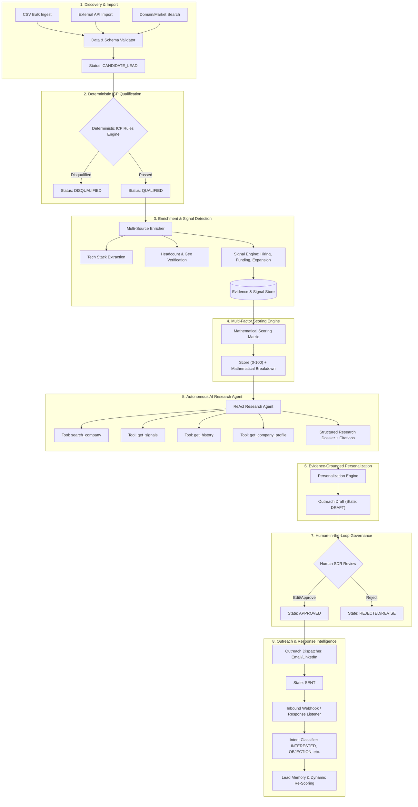
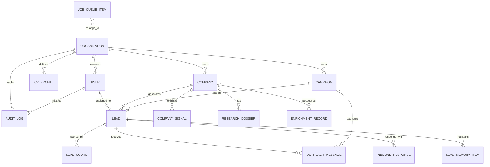
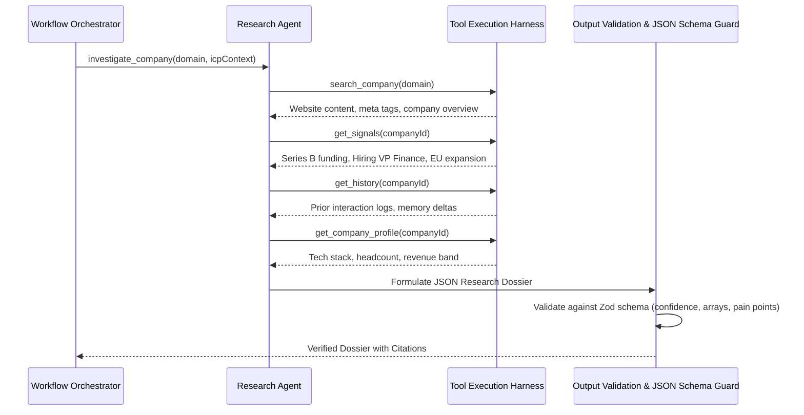
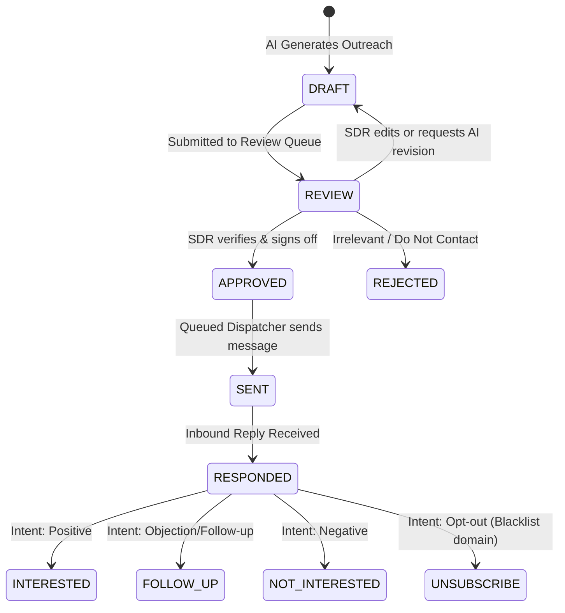

# LeadFlow AI — Architecture & System Design Document
*Enterprise-Grade AI-Powered Lead Intelligence Platform*
**Version:** 1.0.0 | **Author:** LeadFlow Engineering & Product Architecture Team

---

## 1. Executive Summary & Product Vision

Sales and revenue teams are overwhelmed by generic outreach, stale lead databases, and manual prospecting tasks. Traditional tools either scrape surface-level emails with no context (dumb scrapers) or plug entire company descriptions into generic LLM prompts to spit out superficial "personalized" emails (GPT wrappers).

**LeadFlow AI** is **NOT** a CRM, NOT a bulk spam mailer, and NOT a simple GPT wrapper. 

It is an **autonomous intelligence & decision pipeline** designed to answer 5 fundamental questions for high-velocity enterprise and B2B sales teams:
1. **Which companies should we contact?** (Deterministic ICP Filtering & Discovery)
2. **Why are they good prospects right now?** (Multi-Source Signal & Timing Engine)
3. **What verifiable evidence supports this?** (Adversarial Multi-Tool AI Research Agent)
4. **What should we say to them?** (Signal-grounded, role-specific personalization with citation trails)
5. **What happened after outreach?** (Deterministic & LLM response classification feeding back into Lead Memory)

### Core Architectural Philosophy: The Deterministic + Probabilistic Hybrid
> **Crucial Rule**: *Never use an LLM for operations that can be computed deterministically, audited precisely, or filtered mathematically.*

```
┌────────────────────────────────────────────────────────────────────────┐
│                        LEADFLOW HYBRID ENGINE                          │
├──────────────────────────────────┬─────────────────────────────────────┤
│   DETERMINISTIC LAYER (Code)     │     PROBABILISTIC LAYER (LLM)       │
├──────────────────────────────────┼─────────────────────────────────────┤
│ • ICP rule matching (Size/Geo)   │ • Synthesizing strategic moats      │
│ • Mathematical multi-factor score│ • Deep pain-point extraction        │
│ • State transitions (DRAFT->SENT)│ • Tone-calibrated outreach drafting │
│ • Idempotency & deduplication    │ • Response sentiment & intent triage│
│ • Rate limiting & retry backoffs │ • Multi-source web fact synthesis   │
└──────────────────────────────────┴─────────────────────────────────────┘
```

---

## 2. End-to-End System Pipeline

The system transforms raw unstructured company domains into qualified, high-conviction opportunities through a 9-stage asynchronous pipeline.



---

## 3. Database Architecture & Multi-Tenancy

The database model is built with strict multi-tenancy, complete referential integrity, and dedicated tables for historical memory and audit trails.

### Multi-Tenant Entity Relationship Diagram



### Table Specifications

1. **`organizations`**: Workspace container enforcing tenant isolation.
   - `id` (UUID), `name`, `domain`, `plan`, `settings` (JSONB), `createdAt`, `updatedAt`
2. **`users`**: Platform actors (SDR, AE, Sales Manager, Admin).
   - `id`, `orgId` (FK), `email`, `name`, `role` (`SDR`, `AE`, `SALES_MANAGER`, `ADMIN`), `createdAt`
3. **`icp_profiles`**: Deterministic qualification rule criteria.
   - `id`, `orgId` (FK), `name`, `targetIndustries` (`text[]`), `minEmployees`, `maxEmployees`, `targetCountries` (`text[]`), `targetRoles` (`text[]`), `requiredTechnologies` (`text[]`), `minimumScoreThreshold`, `isActive`
4. **`companies`**: Master company intelligence entity.
   - `id`, `orgId` (FK), `domain` (Unique per org), `name`, `website`, `industry`, `employeeCount`, `country`, `technologies` (`text[]`), `fundingStage`, `totalRaisedUSD`, `status` (`CANDIDATE`, `QUALIFIED`, `DISQUALIFIED`, `NURTURING`), `createdAt`, `updatedAt`
5. **`enrichment_records`**: Provenance-tracked data points.
   - `id`, `companyId` (FK), `field`, `value` (JSONB), `source` (`WEBSITE`, `LINKEDIN`, `CRUNCHBASE`, `CLEARBIT`, etc.), `confidence` (0.00-1.00), `fetchedAt`
6. **`company_signals`**: Verified market events with timestamp & source.
   - `id`, `companyId` (FK), `type` (`HIRING_GROWTH`, `FUNDING_ROUND`, `GEO_EXPANSION`, `LEADERSHIP_CHANGE`, `TECH_ADOPTION`), `headline`, `detail`, `sourceUrl`, `confidence` (Float), `detectedAt`
7. **`leads`**: Specific target contacts within a company.
   - `id`, `orgId` (FK), `companyId` (FK), `fullName`, `email`, `role`, `seniorityLevel`, `linkedinUrl`, `status` (`NEW`, `QUALIFIED`, `RESEARCHING`, `OUTREACH_READY`, `OUTREACH_PENDING_APPROVAL`, `CONTACTED`, `RESPONDED`, `CONVERTED`, `LOST`), `assignedUserId` (FK)
8. **`lead_scores`**: Versioned, explainable score calculations.
   - `id`, `leadId` (FK), `companyId` (FK), `totalScore` (0-100), `industryFitScore`, `sizeFitScore`, `signalFitScore`, `techFitScore`, `roleFitScore`, `engagementScore`, `formulaVersion` (e.g. `v1.2.0`), `explanation` (JSONB with itemized `+XX` breakdown), `createdAt`
9. **`research_dossiers`**: Agent-synthesized company research briefs.
   - `id`, `companyId` (FK), `summary`, `painPoints` (JSONB), `strategicSignals` (JSONB), `qualificationReasons` (JSONB), `confidenceScore` (Float), `rawToolOutputs` (JSONB), `agentVersion`, `generatedAt`
10. **`outreach_messages`**: Personalized copy governed by human approval states.
    - `id`, `leadId` (FK), `campaignId` (FK), `subject`, `body`, `channel` (`EMAIL`, `LINKEDIN`), `state` (`DRAFT`, `REVIEW`, `APPROVED`, `SENT`, `FAILED`), `usedSignals` (JSONB array of signal IDs), `reviewerUserId` (FK), `approvedAt`, `sentAt`
11. **`inbound_responses`**: Classified recipient responses.
    - `id`, `messageId` (FK), `leadId` (FK), `channel`, `rawContent`, `classification` (`INTERESTED`, `FOLLOW_UP`, `NOT_INTERESTED`, `UNSUBSCRIBE`), `confidence`, `reasoning`, `receivedAt`
12. **`lead_memory_items`**: Time-series memory detecting longitudinal changes.
    - `id`, `leadId` (FK), `companyId` (FK), `eventType` (`SCORE_CHANGE`, `NEW_SIGNAL`, `OUTREACH_SENT`, `RESPONSE_RECEIVED`), `deltaDescription`, `previousState` (JSONB), `newState` (JSONB), `timestamp`
13. **`jobs`**: Asynchronous task orchestration & reliability ledger.
    - `id`, `orgId` (FK), `queueName`, `jobType`, `payload` (JSONB), `status` (`WAITING`, `ACTIVE`, `COMPLETED`, `FAILED`, `DLQ`), `attempts`, `maxAttempts`, `lastError`, `idempotencyKey`, `processedAt`
14. **`audit_logs`**: Immutable enterprise compliance and user activity log.
    - `id`, `orgId` (FK), `userId` (FK), `action`, `entityType`, `entityId`, `metadata` (JSONB), `ipAddress`, `timestamp`

---

## 4. Deterministic Qualification vs. Probabilistic AI

### Why Simple Filtering Must Be Pure Code
If a user specifies:
- Industry: `B2B SaaS`, `FinTech`
- Employee Count: `50 - 500`
- Geography: `US`, `UK`, `India`
- Role: `CFO`, `VP Finance`, `Founder`

Invoking an LLM to evaluate whether `800 employees` falls within `50-500` introduces:
- High latency ($~1500\text{ms}$ vs $0.02\text{ms}$)
- Non-deterministic flakiness & edge-case hallucination
- Wasteful API costs (~$0.01 per evaluation vs zero)

In LeadFlow AI:
$$\text{IsQualified}(\text{Lead}, \text{ICP}) = \mathbb{I}(\text{Industry} \in \text{ICP.Industries}) \land (\text{Min} \le \text{Count} \le \text{Max}) \land (\text{Geo} \in \text{ICP.Countries})$$

Only if this evaluates to `true` does the lead transition to `QUALIFIED` status and proceed to the signal-weighted scoring and AI agent pipeline.

---

## 5. Mathematical Lead Scoring Formulation

The scoring engine executes version-controlled deterministic calculation using verified signals and profile attributes:

$$\text{Total Score} = w_1 S_{\text{industry}} + w_2 S_{\text{size}} + w_3 S_{\text{growth}} + w_4 S_{\text{tech}} + w_5 S_{\text{role}} + w_6 S_{\text{engagement}}$$

### Standard Weight Distribution

| Component | Weight ($w_i$) | Max Points | Evaluation Logic |
| :--- | :--- | :--- | :--- |
| **Industry Fit** | $25\%$ | 25 | Direct target industry match: 25. Adjacent: 15. Non-match: 0. |
| **Company Size** | $20\%$ | 20 | Center of sweet-spot: 20. Acceptable range bounds: 10-18. Out: 0. |
| **Growth Signals** | $20\%$ | 20 | Recent funding round ($+10$), Hiring finance headcount ($+10$), Expansion ($+5$), capped at 20. |
| **Technology Fit**| $15\%$ | 15 | Direct ERP/Billing/CRM stack match ($+5$ per tech up to 15). |
| **Role Fit** | $10\%$ | 10 | CFO/VP: 10. Director: 8. Manager: 5. Irrelevant: 0. |
| **Engagement** | $10\%$ | 10 | Website visit/prior response: 10. Cold: 0. |

### Output Contract: Total Score & Explainability Payload
```json
{
  "totalScore": 91,
  "formulaVersion": "v1.0.0",
  "explanation": {
    "breakdown": [
      { "factor": "Industry Fit", "points": 25, "max": 25, "reason": "+25 B2B SaaS target match" },
      { "factor": "Company Size", "points": 18, "max": 20, "reason": "+18 Headcount 180 is within optimal 50-500 bracket" },
      { "factor": "Growth Signals", "points": 20, "max": 20, "reason": "+10 Series B funding ($28M) + +10 Hiring VP Finance" },
      { "factor": "Technology Fit", "points": 10, "max": 15, "reason": "+10 Uses Stripe, Salesforce, Netsuite" },
      { "factor": "Role Fit", "points": 10, "max": 10, "reason": "+10 Direct CFO target persona" },
      { "factor": "Prior Engagement", "points": 8, "max": 10, "reason": "+8 Clicked research link in Q1 nurture" }
    ],
    "summaryText": "Score 91/100: Prime B2B SaaS candidate experiencing active finance leadership expansion following Series B funding."
  }
}
```

---

## 6. Autonomous AI Research Agent Architecture

The Research Agent is a tool-augmented synthesis pass, not a ReAct loop. Four deterministic
tools gather evidence up front, then a single model call synthesises a dossier that is validated
against a Zod schema, with a deterministic fallback when validation fails. The model does not
choose which tools to call and there is no reason/act/observe iteration.



### Agent Tool Interfaces
1. `search_company(domain: string)`: Retrieves verified public web presence, about/product pages, and meta profiles.
2. `get_signals(companyId: string)`: Reads verified chronological event signals from `company_signals`.
3. `get_history(companyId: string)`: Fetches past touches, response logs, and score deltas from `lead_memory_items`.
4. `get_company_profile(companyId: string)`: Retrieves structured metadata (headcount, founding year, tech stack).

### Validated Output Contract
```typescript
interface CompanyResearchOutput {
  summary: string;
  pain_points: Array<{
    area: string;
    description: string;
    evidence: string;
  }>;
  signals: Array<{
    signal: string;
    relevance: string;
    confidence: number;
  }>;
  qualification_reasons: string[];
  confidence: number; // 0.00 to 1.00
}
```

---

## 7. Personalization & Human Review State Machine

Personalization synthesizes **Research + Signals + Role + Previous History** into high-relevance messaging.

### Anti-Pattern vs. LeadFlow Pattern
- **Superficial Pattern:** *"Hi John, I saw Acme Corp is growing fast! We help companies scale."* (Discarded).
- **LeadFlow Pattern:** *"Hi John, noticed Acme recently closed your Series B and is actively recruiting a VP Finance while expanding operations to the UK. As CFO, scaling multi-currency financial close across regions is likely top-of-mind right now."* (Evidence-backed).

### Human-in-the-Loop State Lifecycle



---

## 8. Asynchronous Workflow, Reliability & Queue Design

All intensive workloads (Enrichment, Web Crawling, Signal Detection, Agent Research, Score Recalculation, Dispatching) are decoupled from HTTP request loops using an asynchronous Queue Architecture.

### Distributed Resilience Mechanisms
1. **Idempotency Keys**: Every job payload is hashed (`SHA256(companyId + action + timestamp_bucket)`). Duplicate triggers within a configurable cooldown period are discarded immediately.
2. **Exponential Backoff Retries**: Transient failures (network timeouts, 429 rate limits) retry up to 3 times with exponential backoff:
   $$\text{Delay}(n) = \min(\text{maxDelay}, \text{initialDelay} \times 2^n) + \text{jitter}$$
3. **Dead-Letter Queue (DLQ)**: Jobs failing 3 consecutive attempts are quarantined in the `DLQ` with stack traces, triggering an alert without stalling the pipeline.
4. **In-Process Database-Backed Job Runner**: The queue is a polling worker backed by the
   `Job` table — no Redis and no BullMQ. This keeps deployment to a single process plus a
   database, which suits single-node use. It does not coordinate across replicas; running
   multiple instances would require a real broker.

---

## 9. Observability & Telemetry Framework

LeadFlow embeds real-time observability across four dimensions:
1. **Pipeline Throughput**: Leads processed per minute, queue depth, active vs waiting jobs.
2. **Reliability & Quality**: Job retry counts, DLQ error rates, JSON schema validation failure rate.
3. **AI Economics**: Real-time token consumption ledger, cost calculation per dossier, prompt-to-completion ratio.
4. **Latency SLAs**: P50, P90, and P99 latency tracking for enrichment, scoring, and research agent executions.

---

## 10. Step-by-Step Implementation Roadmap

| Phase | Milestone | Deliverables |
| :--- | :--- | :--- |
| **Phase 1** | **ICP & Lead Discovery** | Multi-tenant schema, CSV import engine, validation parser, deterministic ICP filters, candidate lead management. |
| **Phase 2** | **Enrichment & Signal Engine** | Provenance-tracked data enrichment, multi-source signal detector (hiring, funding, tech, expansion). |
| **Phase 3** | **AI Research Agent** | Tool-augmented research agent (4 deterministic tools), Zod schema validation, deterministic fallback recovery. |
| **Phase 4** | **Mathematical Scoring Engine** | Versioned multi-factor scoring algorithm, itemized explainability breakdown, historical lead memory. |
| **Phase 5** | **Outreach & Review System** | Evidence-grounded personalization engine, Human-in-the-Loop review states (`DRAFT` $\to$ `SENT`). |
| **Phase 6** | **Reliable Async Queue** | Database-backed polling queue, SHA-256 idempotency keys, bounded retries, DLQ. |
| **Phase 7** | **Response Intelligence & Analytics**| Inbound response classification, feedback loop re-scoring, SDR & Sales Manager observability dashboards. |
| **Phase 8** | **Benchmarks & Evaluation** | Two-tier evaluation suite in `evals/`: pure-function qualification metrics (CI-runnable) and live outreach-quality measurement. |

---
