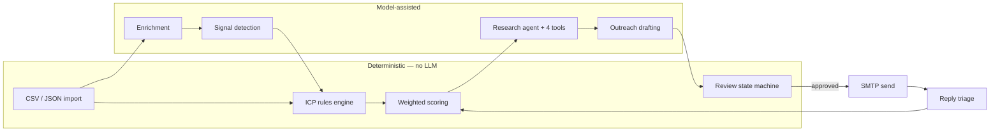

# LeadFlow

**Turn a list of companies into researched, evidence-grounded sales outreach that a human approves before anything is sent.**

LeadFlow is a working B2B prospecting tool. You import companies, define who you sell to, and it enriches each account, detects buying signals, qualifies it against your ICP, scores it, researches it, and drafts outreach grounded in what it actually found. Nothing leaves the system until a person approves it.

It is built around one rule: **use an LLM only where judgement is genuinely needed.** Qualification, scoring, and the review state machine are deterministic code — auditable, instant, and free. The model is used for research synthesis and copywriting, where it earns its cost.

---

## Why this exists

Most prospecting tools either spray generic templates or hand you a chatbot. Both fail the same way: nobody can tell *why* a lead was picked, or *what evidence* a message is based on.

LeadFlow answers five questions, and shows its work for each:

| Question | How it is answered |
| :--- | :--- |
| Which companies should we contact? | Deterministic ICP rules — no model, no hallucination |
| Why them, why now? | Signal detection: funding, hiring, expansion, leadership change |
| What evidence backs that? | A research dossier built from four tools, schema-validated |
| What do we say? | Copy grounded in the specific signals found, with the evidence attached |
| What happened after? | Reply triage reclassifies intent and re-scores the account |

---

## What is real, and what is not

This section exists because most project READMEs overstate. Here is the honest boundary.

**Works today**
- CSV/JSON lead import, ICP management, enrichment, signal detection, scoring, research dossiers, outreach drafting, human review, reply triage, analytics
- **Real email sending over SMTP.** Works with Gmail app passwords, SendGrid, Mailgun, Postmark, SES
- A review gate that genuinely blocks sending — `dispatch` refuses anything not in `APPROVED`
- An evaluation suite whose numbers are computed at run time, not written by hand

**Deliberate limits**
- **No email sending without SMTP configured.** The app will not mark a message `SENT` that it did not send. Without SMTP you approve drafts and copy or export them.
- **Single-tenant.** There is no auth or login; it runs as one workspace. Do not expose it to the internet as-is.
- **Signal detection is model-sourced.** Signals come from the model's knowledge, not a live news feed. Treat them as leads to verify, not facts.
- **No LinkedIn automation.** Removed deliberately — it required replaying a session cookie, which violates LinkedIn's terms and puts the user's account at risk.

---

## Architecture



**Why the split:** qualification runs in microseconds, costs nothing, and returns the same answer every time — so it must never be a model call. Scoring is a versioned weighted formula producing an itemised breakdown you can audit. The review gate is a state machine: `DRAFT → REVIEW → APPROVED → SENT`, and the send path hard-fails on any other state.

The research agent is a **tool-augmented synthesis pass**, not a ReAct loop: four deterministic tools (`search_company`, `get_signals`, `get_history`, `get_company_profile`) gather evidence, then one model call synthesises a dossier that is validated against a Zod schema, with a deterministic fallback when validation fails.

See [ARCHITECTURE.md](ARCHITECTURE.md) for the data model and request flows.

---

## Evaluation

Run it yourself: `cd backend && npm run evals`. It writes [backend/evals/REPORT.md](backend/evals/REPORT.md).

The suite is in two tiers. **Tier 1** is a pure function — no database, no network, no API key — so it runs in CI on every push. **Tier 2** needs a database and a real key, and reports itself as *skipped* when they are absent rather than printing a placeholder number.

**Tier 1 — ICP qualification**, 20 hand-labelled cases including 5 adversarial ones:

| Metric | Result |
| :--- | :--- |
| Accuracy | 100% (20/20) |
| Precision / Recall | 1.00 / 1.00 |
| Latency p50 / p99 | 0.023ms / 0.218ms |

That 100% is only meaningful because of how it was reached. **On its first run the suite failed 4 of 18 cases, at 63.6% precision.** It found four real over-acceptance bugs:

- `Agriculture Software` qualified against a `Software` ICP, because matching used `String.includes`
- `Executive Assistant to the CEO` qualified as a CEO, for the same reason
- A blank country auto-passed, admitting accounts from any region
- A blank role auto-passed, with no decision-maker confirmed

Matching is now token-aware with word boundaries, generic-suffix handling (`FinTech Solutions` still matches `FinTech`), and an explicit support-role exclusion list. Unknown values are handled by risk: unknown headcount is provisionally accepted pending enrichment, while unknown country or role is rejected.

**Tier 2 — generated outreach quality** (n=10, real Gemini calls):

| Metric | Result |
| :--- | :--- |
| Fell back to template | 0% |
| Signal grounding | 100% |
| Fluff / placeholder leak | 0% / 0% |
| Mean length | 92 words |

**Limitations, stated plainly.** Twenty author-written cases is a regression guard, not evidence about real-world lead quality. Grounding is a *lexical* check — it proves copy reuses terms from its evidence, not that the claims are true. None of these numbers measure the underlying model; they measure this system's rules, prompts and plumbing.

### A bug the suite caught

Tier 2 initially reported a perfect 100% grounding and 0% fluff — which was wrong. Every model call was failing with a 404 (`gemini-2.0-flash` had been retired by Google), each service was catching the error and silently returning its deterministic fallback, and the eval was scoring those hand-written templates as if they were model output.

Two fixes: `generateOutreach` now reports `generatedBy: 'llm' | 'fallback'` so a degraded run cannot pass as healthy, and the eval reports fallback rate separately and scores quality on model output only. Model IDs moved behind env-overridable aliases (`gemini-flash-latest`) so a retirement cannot silently gut the pipeline again.

Written up in full, including the three reasons it stayed invisible: **[docs/POSTMORTEM-silent-model-outage.md](docs/POSTMORTEM-silent-model-outage.md)**.
---

## Getting started

**Requirements:** Node 20+, Docker (or any Postgres), and a [free Gemini API key](https://aistudio.google.com/apikey).

```bash
git clone <your-repo-url> && cd lead-flow

# 1. Start Postgres (or point DATABASE_URL at your own)
docker compose up -d --wait

# 2. Backend
cd backend
npm install
cp .env.example .env          # add your GEMINI_API_KEY
npx prisma db push
npm run dev                   # http://localhost:4000

# 3. Frontend, in a second terminal
cd frontend
npm install
npm run dev                   # http://localhost:5173
```

The app tells you what is configured: `GET /api/config/status` reports database, model and SMTP state, and the review screen shows a banner when sending is off.

**To enable sending**, add SMTP settings to `backend/.env` (see `.env.example`). For Gmail use an [App Password](https://myaccount.google.com/apppasswords), not your account password. Verify with `POST /api/config/smtp/verify`.

### Using it

1. **ICP Studio** — define target industries, headcount band, countries and roles
2. **Lead Intelligence** — paste CSV (`Company,Domain,Industry,Employees,Country,Role,Contact Name,Email`) and run the pipeline
3. **Human Review** — read the evidence behind each draft, edit it, then Approve. Send, Copy, or Export CSV
4. **Reply Triage** — paste a real reply; it classifies intent, re-scores the account and records it
5. **Manager Analytics** — funnel conversion and queue health

---

## Tech

TypeScript throughout. **Backend:** Node 20, Express, Prisma, PostgreSQL, Zod, Playwright, Nodemailer, Winston. **Frontend:** React 19, Vite, Tailwind CSS v4. **AI:** Google Gemini. **CI:** GitHub Actions runs typecheck, the Tier 1 evals, and a frontend build on every push.

Tailwind's `slate` and `indigo` scales are remapped in `src/index.css` to the product's violet-black surface palette, so utility classes and the hand-written component CSS resolve to one coherent colour system rather than two.

Jobs run through an in-process, database-backed queue with SHA-256 idempotency keys, bounded retries and a dead-letter queue. It is a polling worker, not Redis-backed — fine for single-node use, and the honest description of what is there.

## License

[MIT](LICENSE)
